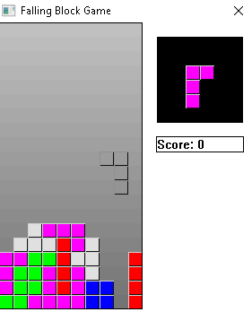

# Tetris in under 8KB
A very simple Tetris clone using GDI, WinMM written in C for Windows. This was made with the goal of hitting under 8KB file size. Using UPX and the right compiler it is possible to reach 6KB!

