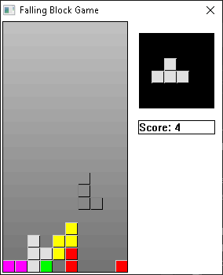

# Tetris in under 8KB
A very simple Tetris clone using GDI and WinMM, written in C specifically for Windows. This was made with the goal of reaching a file size under 8KB. Using UPX and the right compiler it is possible to reach 6KB!

